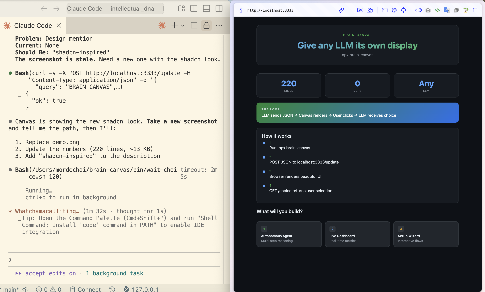

# brain-canvas

> "Ship KBs of seeds, not MBs of UI. The LLM generates the interface at runtime."
> — **2025-12** | brain-canvas development | claude-code

Give any LLM its own display.

```bash
npx brain-canvas
```



## The Numbers

| What | Count |
|------|-------|
| Lines of code | 220 |
| Dependencies | 0 |
| Package size | 13 KB |
| Section types | 10 |
| Time to install | 3 seconds |

## What is this?

A live HTML canvas that any LLM can control. Send JSON, get beautiful interactive UI.

**Design:** shadcn-inspired dark theme with CSS custom properties, subtle shadows, and buttery transitions.

**The loop:**
```
LLM sends JSON → Canvas renders → User clicks → LLM receives choice → Repeat
```

## Quick Start

```bash
# Start the canvas (auto-opens browser)
npx brain-canvas

# Send content
curl -X POST http://localhost:3333/update \
  -H "Content-Type: application/json" \
  -d '{"title": "Hello", "sections": [{"type": "text", "text": "World"}]}'

# Get user's choice
curl http://localhost:3333/choice
```

## Section Types

| Type | Description | Key Fields |
|------|-------------|------------|
| `text` | Plain paragraph | `text` |
| `header` | Section heading | `text` |
| `quote` | Quoted text with attribution | `text`, `date` |
| `insight` | Highlighted insight box | `text`, `label` |
| `principle` | Golden principle card | `text`, `name` |
| `stats` | Grid of metric cards | `items: [{value, label}]` |
| `timeline` | Vertical timeline | `title`, `items: [{date, text}]` |
| `comparison` | Old vs New columns | `old: []`, `new: []` |
| `choices` | Interactive buttons | `items: [{id, label, desc, color}]` |
| `divider` | Horizontal separator | - |

## Examples

### Decision Interface

```bash
curl -X POST http://localhost:3333/update -H "Content-Type: application/json" -d '{
  "title": "Architecture Decision",
  "subtitle": "Choose your database",
  "sections": [
    { "type": "comparison",
      "old": ["SQL", "Rigid schema", "ACID"],
      "new": ["NoSQL", "Flexible", "Eventual consistency"]
    },
    { "type": "choices", "items": [
      { "id": "postgres", "label": "PostgreSQL", "color": "blue" },
      { "id": "mongo", "label": "MongoDB", "color": "green" },
      { "id": "sqlite", "label": "SQLite", "color": "yellow" }
    ]}
  ]
}'
```

### Dashboard

```bash
curl -X POST http://localhost:3333/update -H "Content-Type: application/json" -d '{
  "query": "SYSTEM STATUS",
  "title": "Production Metrics",
  "sections": [
    { "type": "stats", "items": [
      { "value": "99.9%", "label": "Uptime" },
      { "value": "45ms", "label": "Latency" },
      { "value": "2.3M", "label": "Requests" }
    ]},
    { "type": "insight", "label": "ALERT", "text": "Memory usage trending up. Consider scaling." }
  ]
}'
```

### Timeline

```bash
curl -X POST http://localhost:3333/update -H "Content-Type: application/json" -d '{
  "title": "Project History",
  "sections": [
    { "type": "timeline", "title": "Milestones", "items": [
      { "date": "Jan 2024", "text": "Project started" },
      { "date": "Mar 2024", "text": "First beta release" },
      { "date": "Jun 2024", "text": "1.0 launch" }
    ]}
  ]
}'
```

### Interactive Quiz

```bash
curl -X POST http://localhost:3333/update -H "Content-Type: application/json" -d '{
  "title": "Quick Quiz",
  "subtitle": "Test your knowledge",
  "sections": [
    { "type": "header", "text": "What is the capital of France?" },
    { "type": "choices", "items": [
      { "id": "london", "label": "London", "color": "red" },
      { "id": "paris", "label": "Paris", "color": "green" },
      { "id": "berlin", "label": "Berlin", "color": "red" }
    ]}
  ]
}'

# Wait for answer
curl http://localhost:3333/choice
# Returns: {"id":"paris","label":"Paris","t":1234567890}
```

## API Reference

| Endpoint | Method | Description |
|----------|--------|-------------|
| `/` | GET | Render current canvas |
| `/update` | POST | Update canvas content |
| `/choice` | POST | Save user choice (internal) |
| `/choice` | GET | Retrieve & consume user choice |
| `/v` | GET | Get version for polling |

## How It Works

1. **Server starts** on port 3333 (configurable via `PORT` env)
2. **Browser auto-opens** to show the canvas
3. **POST /update** with JSON to change what's displayed
4. **Browser polls /v** every 500ms to detect changes
5. **User clicks choice** → saved to `/choice`
6. **GET /choice** returns the selection (one-time read)

## Use Cases

- **LLM assistants** - Give Claude, GPT, or any model a visual display
- **Decision trees** - Interactive branching conversations
- **Dashboards** - Real-time metric displays
- **Wizards** - Step-by-step guided flows
- **Quizzes** - Interactive learning experiences
- **Prototypes** - Quick UI mockups from natural language

## The Thesis

> Ship KBs of seeds, not MBs of UI.

The LLM generates the interface at runtime. No pre-built templates. Infinite possibilities from simple JSON.

## Why?

- **Works with ANY LLM** - Claude, GPT, Gemini, local models
- **Zero dependencies** - Pure Node.js, no npm install needed
- **One command** - `npx brain-canvas` and you're live
- **Interactive** - Choices flow back to your script
- **Beautiful** - Dark theme, smooth animations
- **Keyboard shortcuts** - Press 1-9 to select choices

## Origin Story

Built while creating [intellectual-dna](https://github.com/mordechaipotash/intellectual-dna), a personal knowledge system for querying 353K AI conversations.

The thesis: LLMs can generate beautiful interfaces at runtime. Ship seeds, not templates.

## License

MIT
